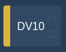
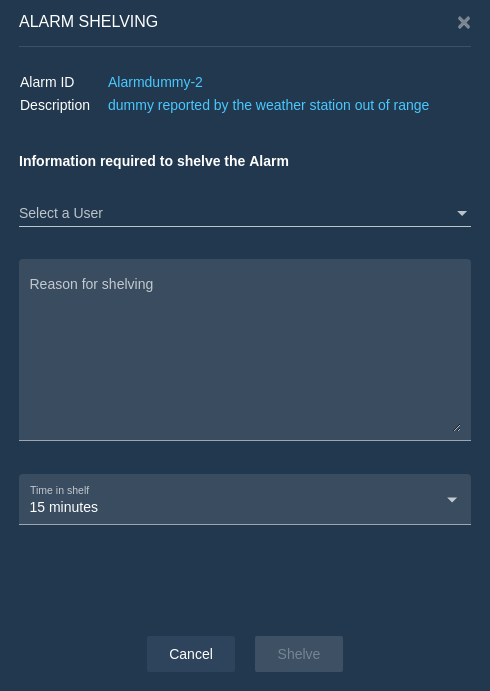
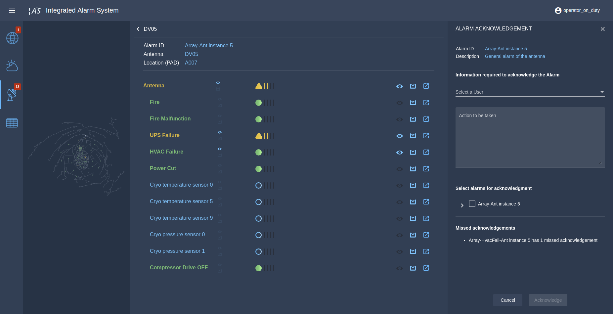
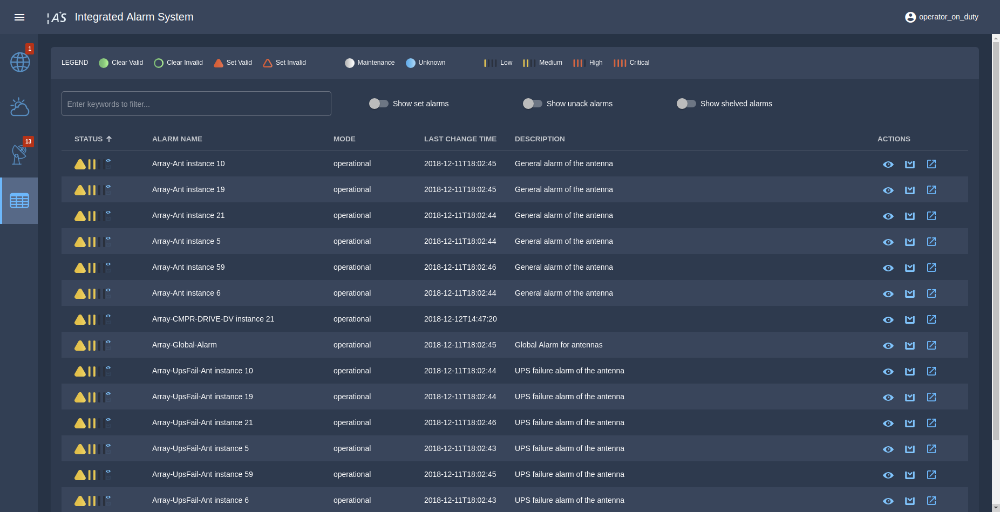
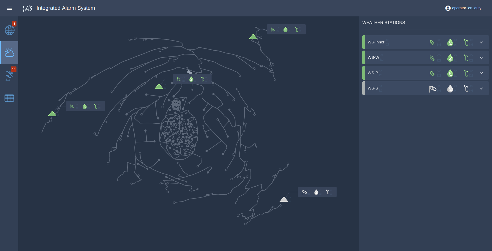

# Operations Manual

## Introduction

The ALMA Observatory consists of many hardware and software systems which are continuously generating data. The operations performed in the observatory, depends on the availability of high-level and easy-to-understand information, about the status for these multiple systems.

The Integrated Alarm System (IAS) is a tool developed to improve the situation awareness of the ALMA operators.

The IAS generates alarms related to multiple monitor points and provides, among other software components, a set of displays with global and specialized views for the status of the different systems. The information is presented in an integrated and homogeneous way, in order to help the operators to interpret this information, and to get more details, in order to make informed decisions. Also, operators working in the control room can perform actions as the *acknowledgement* or *shelving* of alarms.

Other users can access the displays after authentication, but some actions could be restricted according to specific permissions. The description of the authentication and authorization for the IAS can be found at the end of this document.

## Technical Overview

Broadly, the IAS consists on three groups of components:

- a set of *plugins*, software which get the raw data and inject information to the system;

- the *core*, main component of the system which, among other tasks, generates alarms for the different monitoring points, from data provided by the plugins; and

- the *display* component, which take the alarms as an input and organize this information in different pages or *views*, in order to provide an efficient way to find and interpret the information related to this alarms.

Detailed information about the system can be found in the documentation about its design and architecture, available in the [docs](https://github.com/IntegratedAlarmSystem-Group/IntegratedAlarmSystem-Group.github.io/tree/master/docs) folder in the  [IntegratedAlarmSystem-Group.github.io](https://github.com/IntegratedAlarmSystem-Group/IntegratedAlarmSystem-Group.github.io) repository.

## Alarms

The alarms organized in the displays of the system, are displayed using combinations of the marks exposed in the following legend, according to different properties.

The representation for the alarms can be illustrated by the following cases.

| Status  | Value | Validity |  Priority |
|---|---|---|---|
|   | clear | valid | |
|    | clear | invalid | |
|    | set | valid | low |
|   | set | invalid | low |
|    | set | valid  | medium |
|   | set | invalid  | medium |
|    | set | valid | high |
|   | set |  invalid | high |
|   | set | valid | critical |
|   | set |  invalid | critical |

First, we have the *clear* and *set* value, used when an alarm is resolved or if a condition configured in the system for the related device is not satisfied, respectively. The mark related to each status is shown in green, for the *clear* value, and red or yellow, for the *set* value.

The usage of the colors red and yellow depends on the priority level of the alarm: low, medium, high and critical, from lowest to highest.

Each alarm is validated by receiving regular messages from the system, according to a tolerance range of time. If these messages has a delay greater than this tolerance, then an alarm it is declared as *invalid*. We can notice the difference between a *valid* alarm and a *invalid* alarm because a valid alarm will be shown with a filled mark, whereas an invalid alarm will be shown with an unfilled mark.

Finally, each alarm has a related *operational mode*, which can be used to get contextual information related to the monitoring point. Some selected modes are highlighted in the displays for the operators, such as the *maintenance* mode and the *unknown* mode.

| Status  | Validity | Mode |
|---|---|---|
|   | valid |  maintenance |
|   | invalid  | maintenance |
|   | valid | unknown |
|    | invalid | unknown |

According to the IAS configuration, an alarm can also have dependencies related to other alarms according to a hierarchy, for example, when monitoring points are related to a selected device and its subcomponents.

**Sounds**

The system has 4 available sounds, one for each priority level.

Each alarm should be configured to trigger these sounds, when its value change from *clear* to *set*. The related sound will stop automatically after few moments.

Only for the top most priority alarms (*critical*) the sound persists until the user *acknowledge* the alarm. The *acknowledgment* action is described in the next section.

## Actions

Three type of actions can be triggered per alarm (depending on its status): *acknowledgement* (ack), *shelving* (shelve), and a *go to documentation* option.
These actions are available through the different pages of the web application, according to the following icons.

| Icon  | Action  |
|---|---|
|  | ack  |
|   | shelve  |
|   | go to documentation  |

Usually, a set of buttons for each action will be displayed aside the status of an alarm.

Only operators working in the control room can perform the *ack* and *shelve* actions using a special *operator_on_duty* account, described in the authentication and authorization section, at then end of this document. In the following sections, the operators working in the control room will be named as *operators*.

### Acknowledgment

The operators are requested to use the *ack* action each time an alarm is active.

To acknowledge an alarm, the operator can click on the *ack* button to open an *acknowledgement form* to be submitted, in order to keep a log. Cleared alarms could show the acknowledgement as an available action if there was a change from a *set* value to a *clear* value, which was not previously acknowledged by the operator.

This form must contain: the decision taken in response to the problem, an identifier for the member of the team of operators which acknowledge the alarm, and a selection of alarms to be acknowledged. This selection is related to the case of the existence of dependencies for the selected alarm, and is intended to avoid the acknowledgment action without noticing a root cause of the activation.

After completing the form, the *Acknowledge* button will be available to perform the *ack* action.

After perform the acknowledgment of an alarm, the user will receive a message with the acknowledged alarms in the system.

Users with no acknowledgment permissions will receive a message after trying to perform this action. Only operators can acknowledge an alarm.

When an alarm changes its status to a new one with a *set* value, it can only be acknowledged once. After an alarm is acknowledged, the related action button will be disabled.

We should notice that an active alarm will retain its active status even if it is acknowledged, until the problem is solved.

**Ack status and the *pending acknowledgment* mark**

Some components in the views will show a little mark for alarms with a pending acknowledgment, placed at the top right corner.

After the acknowledgment of an alarm, this mark will not be highlighted as a confirmation of the *ack* state of the alarm.

### Shelving

An operator can use the Shelve option when they need to temporarily silence an alarm so this alarm does not distract them while the problem with this alarm is being solved.

The alarms that could allow the shelving action, should be configured in the IAS configuration database.

The shelve action requires a description of the reason of shelving and it also requires setting up a shelving time, that ranges from 15 minutes to 12 hours top. Once the information is provided the shelve button will be available.

A summary of the action will be provided after shelve an alarm.

After the selected time, the alarm goes back to its original state.

Once an alarm was shelved, the *shelve* button will be replaced by an *unshelve* button to reverse this action, if necessary.

Users with no shelving permissions will receive a message after trying to perform this action. Only operators can shelve an alarm.

If required, some alarms could not allow the shelve action, condition which should be established in the configuration of the IAS.

**Ack status and the *shelved* mark**

Some components in the views will show a little mark for shelved alarms placed at the bottom right corner.

Notice that the status is displayed as a *clear* status, to prevent distractions for the operators.

After perform an *unshelve* action on an alarm, this mark will not be highlighted, as a confirmation of the *not shelved* state of the alarm, and the status will go back to the original state.

### Other actions

Finally, an operator can use the *go to documentation* option, which allows the user to look for additional information so they can make an informed decision.

This option could be found at the end of the actions available for each alarm.

## Views

The IAS offers a view with panels that summarize the alarms per system, as well as specialized views for these systems.

Currently, the available views in the IAS are: Overview, Weather Station, Antennas and a Tabular view.

These views share a set of main components which are described below.

**Toolbar**

Component placed at the top of the application. Here the user can find, at the right, a user's menu, with the name of the currently used account for authentication and the logout option.

**Navigation Sidenav**

A navigation bar placed at the left of the screen can be used to explore the available views.

The *collapse menu button* available at the right of the toolbar, can be used to expand this component, to display the names of the views.

Notifications labels are shown in each view's icon. They represent the number of
set alarms that have not been acknowledged yet. The label disapears if all the alarms of that view are acknowledged.

If the web application lost the connection with the server, the notifications
appear in all the views, in blue color and with a question mark.

            

**Content**

Container for the main content for each view.

**Action Sidenav**

Views that allows the *ack* and *shelve* actions on the alarms, share an additional sidenav component with the related forms.

### Global Views

**Overview**

In the current Overview the users will find 3 small panels with global information about the alarms related to the:

- *IAS Health*, that shows the general *health* of the system (if software components working properly);
- *Weather Station* status, that have summaries of their specific indicators (wind speed, humidity and temperature), and the
- *Antenna* status.

It is important to notice that the overview GUI can contain several panels, in order to show the information of other systems contained in the IAS.

**Tabular View**

In this view all the alarms generated by the IAS are organized in a table. Each row contains the following information:

- a global status for the alarm, according to its different values,
- an identifier for the alarm,
- the operational mode,
- the time of the last change in the status of the alarm,
- a brief description, and
- related actions.

Notice that the information shown about the alarms is related to its current state.

***Filtering and sorting***

Currently, the operators can use the text filter to look for particular alarms. Also, they can activate predefined filters according to specific properties for:

- alarms with a *set* value;
- alarms with a pending acknowledgment; and
- shelved alarms.

The operator can also use the sorting options for the different columns in the table, such as:

- status,
- alarm name,
- alarm mode,
- last change time, and
- description.

### Specialized Views

**Weather View**

The weather view shows a set of alarms related to weather conditions that can affect the functioning of the antennas.

This section displays the alarms information both using a list view and a graphical support in the form of a map. This map was build using a transformation on the geographic coordinates in order to have a better representation, because of the different distances between the pads where the antennas are located.

***Sidebar***

The sidebar lists the alarms for the weather stations. Each weather station has three sub-alarms (wind speed, humidity and temperature), with the *ack*, *shelve*, and *go to documentation* options available for each alarm.

Also it provides a list of nearby antennas that could be affected by the monitored conditions.

These antennas are shown both in the map and the list view.

***Weather Stations Map***

Additionally, the Weather Station section uses a map of the summit to show in a more visual way the information mentioned before. The map shows:

- the pads for the antennas (unfilled circles),
- the current location of the antennas (filled circles) and
- the main Weather Stations with information about its sub-alarms.

When selecting one of these weather stations, the associated pads and associated antennas are highlighted.

An special mark for the location of the AOS, after the transformation of the geographical coordinates, is displayed in the map as a reference point.

**Antennas View**

The antennas view shows the information about the alarms related to each antenna (currently, those related to the *Utility Module*).

This view, uses a similar structure that the one is used for the weather stations.

At the bottom of the antennas grid, there are three general alarms also related with the array. They are:

- Master Laser Alarm
- Correlator Alarm
- Central Local Oscilator Alarm (CLO)

***Sidebar***

When we access each antenna we can see a list of the related alarms. Currently, we can find the alarms from the *Utility Module*, listed below:

- Fire
- Fire Malfunction
- UPS Failure
- HVAC Failure
- Power Cut
- Cryo temperature sensor 0
- Cryo temperature sensor 5
- Cryo temperature sensor 9
- Cryo pressure sensor 0
- Cryo pressure sensor 1
- Compressor Driver OFF

***Antennas Map***

Unlike the map used in the Weather Station view, in this section only the antennas (and pads) are shown in the map.

The user can click on any antenna to open the sidebar with the details described before.

An special mark for the location of the AOS, after the transformation of the geographical coordinates, is displayed in the map as a reference point.

## Authentication and Permissions

The current version of the IAS has an authentication and authorization system, according to selected user permissions.

A *Login* page is available when a user access the application. Some predefined accounts are available for operators to allow different actions.

The predefined accounts are:

- **operator_on_duty** : main account allowed to ack and shelve alarms, it is intended to be used in the operators’ control room; and
- **admin** : superuser account.

Any other account created for the application, will be able to see the different views, but the ack and shelve actions will not be allowed.

Additionally, the users can be added to an operators group. Users in this group are listed in the acknowledgment and shelve forms. A user in this group should be selected in order to endorse these actions.

Notice that the account operator_on_duty is not included in the operators group, and at least, one additional user account should be included in this group to perform ack and shelve actions.
