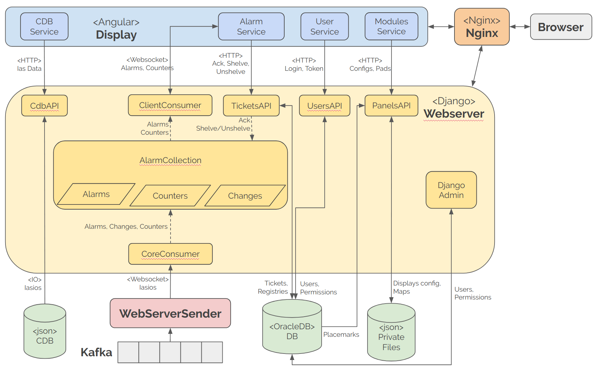

# Web Apps Documentation

This document explains how the Web Applications (___Webserver___ and ___Display___) work, and how they interact with each other.

## 1. Components Overview
This section presents a brief overview of the Web Applications and their purpose.

### 1.1. WebServerSender
The ___WebServerSender___ is in charge of reading IASIOS from the `BsdbCoreKTopic` of the ___Kafka___ queue and send them through Websockets to the ___Webserver___.
It is implemented in Java and it is part of the components delivered in the [ias](https://github.com/IntegratedAlarmSystem-Group/ias) repository.

### 1.2. WebServer
The ___Webserver___ is in charge of receiving the IASIOS from the ___WebServerSender___, maintain an internal copy with the last state for each Alarm and send the changes to the ___Display___. Additionally, the ___Webserver___ provides an HTTP API to perform Acknowledgement or Shelving/Unshelving of Alarms, and requesting configurations and other info required by the ___Display___. It also provides and controls access for users to the ___Display___, handling users permissions, authorization, tokens, etc.

The ___Webserver___ is implemented in Python using the framework Django 2, specifically its libraries Django Rest Framework (DRF) 3, for the REST API, and Channels 2, for the Websockets communications. The ___Webserver___ is delivered in the [ias-webserver](https://github.com/IntegratedAlarmSystem-Group/ias-webserver) repository, and more information is available in its [documentation](https://integratedalarmsystem-group.github.io/ias-webserver/)

### 1.3. Display
The ___Display___ is in charge of receiving Alarms from the ___Webserver___ and displaying them to operators though different views. It also offers interfaces to perform some actions over the Alarms, such as Acknowledge, Shelve and Unshelve.

The ___Display___ is implemented using the Angular 7 framework, it is delivered in the [ias-display](https://github.com/IntegratedAlarmSystem-Group/ias-display) repository, and more information is available in its [documentation](https://integratedalarmsystem-group.github.io/ias-display/index.html)

### 1.4. Nginx
NGINX is a well known load balancer and proxy. It is in charge of handling all the users interaction redirecting the requests to the corresponding application, either the ___Webserver___ or the ___Display___. It is built from the official Nginx Docker image with a custom configuration file, as defined in the integration-tools repository in the [nginx](The ___Webserver___ is delivered in the [ias-webserver](https://github.com/IntegratedAlarmSystem-Group/integration-tools/tree/develop/nginx) repository


## 2. Components Interaction and Communication
The following diagram summarizes how the Web Applications interact and communicate, and which parts of them are in charge of different tasks:




## 2.1. Alarms Reception and Notification
### 2.1.1. Alarms reception from IAS Core
The ___WebServerSender___ reads the IASIOS from the Kafka Queue and sends a list of IASIOS through websockets to the ___Webserver___. The list is sent periodically or when a maximum of Alarms is received, both parameters (period and maximum alarms) are configurable via Java properties.

The ___Webserver___ receives the messages using its ___CoreConsumer___, which is a Django Channels Consumer. The ___CoreConsumer___ receives the list of IASIOS, transforms them into Python objects, modeled under the classes "Alarm" or "IASValue" (depending if the IASIO represents an alarm or a synthetic parameter, respectively), and saves them in the ___AlarmCollection___. The ___AlarmCollection___ maintains the state of the Alarms, keeping the latest value received for every Alarm in a HashTable indexed by ID. The ___AlarmCollection___ compares the timestamp of any newly received IASIO with the timestamp of the current Alarm/IASValue in the collection, keeping only the latest values.

After the ___AlarmCollection___ receives a newer value of an Alarm, the Alarm in the HashTable is updated with the attributes of the received IASIO. If the attributes imply an important difference (that is, either the Value, Validity, Operational Mode, Dependencies or Properties have changed), the ID of the alarm is recorded in the `alarm_changes` list.

### 2.1.1. Alarms notifications to the Display
The ___Webserver___ executes 2 tasks periodically:

1. A notification task, executed every 500 ms, checks if there is any change recorded in the `alarm_changes` list and sends the current values of those Alarms through websockets to the ___Display___, using the ___Webserver___'s ___ClientConsumer___. If there are no alarms to notify, then no message is sent. This period is configurable changing the `NOTIFICATIONS_RATE` parameter in the `ias-webserver/ias_webserver/setting.py` [file](https://github.com/IntegratedAlarmSystem-Group/ias-webserver/blob/e8b111c73d0ece7378fe8aaff5417ea55e6bd189/ias_webserver/settings.py#L262). (Note: changing this parameter requires to rebuild the docker image)

2. A refresh task, executed every 10 seconds, sends the last status of all the Alarms through websockets to the ___Display___, using the ___Webserver___'s ___ClientConsumer___. This period is configurable changing the `BROADCAST_RATE` parameter in the `ias-webserver/ias_webserver/setting.py` [file](https://github.com/IntegratedAlarmSystem-Group/ias-webserver/blob/e8b111c73d0ece7378fe8aaff5417ea55e6bd189/ias_webserver/settings.py#L263). (Note: changing this parameter requires to rebuild the docker image)

In both cases some `counters` are sent along with the alarms. The counters are a dictionary that maps ___Display___ views with the number of set and non-acknowledged Alarms. This numbers are displayed in the navigation bar at the left of the ___Display___. Both messages have a similar structure but are sent through different "streams" ("alarms" or "request", for notifications and general refresh, respectively), in order to differentiate each case. An example message is presented below:

```
{
  "payload": {
    "alarms": [
      {
        "core_id": "alarm_id_1",
        "value": 0,
        ...
      },
        {
        "core_id": "alarm_id_2",
        "value": 3,
        ...
      },
      ...
        {
        "core_id": "alarm_id_n",
        "value": 0,
        ....
      },
    ],
    "counters": {
      "view_1": 2,
      "view_2": 0,
      ...
      "view_m"; 10
    }
  },
  "stream": "alarms"
}
```

### 2.1.2. Request of Alarms from Display, upon connection
Additionally, the ___Display___ can send a message to the ___ClientConsumer___ in order to request a general update of all the Alarms and counters. That message is sent upon connection and has the following content:

```
{
  "stream": "request",
  "action": "list"
}
```

If the ___Display___ send a message with action "close", the ___ClientConsumer___ will close the websockets connection with that client. This is done when the user logs out of the ___Display___. The message has the following content:
```
{
  "stream": "request",
  "action": "close"
}
```


### 2.2. Webserver Initialization
When the ___Webserver___ starts, it initializes its ___AlarmCollection___ reading the ___CDB___. It creates an alarm for every IASIO that is defined as output of a ___DASU___ present in a ___Supervisor___.


### 2.3. Users Login
When the user logs in the ___Display___, the credentials are sent by the ___Display___'s ___UserService___ to the ___Webserver___'s ___UsersAPI___, through an HTTP request. If the credentials are valid, an authorization token is generated and is sent as a response to the ___Display___. The ___Display___ uses the token to establish the websockets connection and sends it as a header for every HTTP request.

After the login, the ___Display___'s ___CdbService___ and ___AlarmService___ are initialized. The ___CdbService___ sends an HTTP request to for the ___Webserver___'s ___CdbAPI___, in order to ask for the IAS Configuration. The ___AlarmService___ establishes the websockets connection with the ___Webserver___'s ___ClientConsumer___.


### 2.4. Alarms acknowledgment, shelving or unshelving
When the user performs an acknowledgment, shelving or unshelving of Alarms in the ___Display___, this sends an HTTP request to the ___Webserver___'s ___TicketsAPI___. The API updates the corresponding Alarms in the ___AlarmCollection___ and saves the changes in the corresponding "tickets" or "shelve_registries" in the ___OracleDB___.


### 2.5. Display configuration requests
Some views of the ___Display___ require specific configurations in order to draw maps, or to relate Alarms to icons and locations in the view. In such cases, the view uses a specialized Service to perform an HTTP request to the  ___Webserver___'s ___PanelsAPI___. The API, reads the configuration files from the ___Private Files___ and sends the response back to the ___Display___.

The code of the ___Display___ is organized in modules, where each type of view has its own module with its own services, those services (___ModulesService___ in the diagram) handle the required HTTP requests. For more details check the [ias-display documentation](https://integratedalarmsystem-group.github.io/ias-display/index.html).

### 2.6. Django admin
the ___Django Admin___ is a predefined view that is shipped with Django. It enables authorized users to handle the Database from an specialized administrators view. The view is available through the sub URL `/admin`, e.g. `<address-of-the-application>/admin`.
